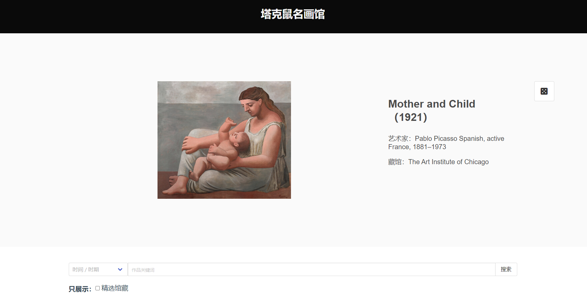
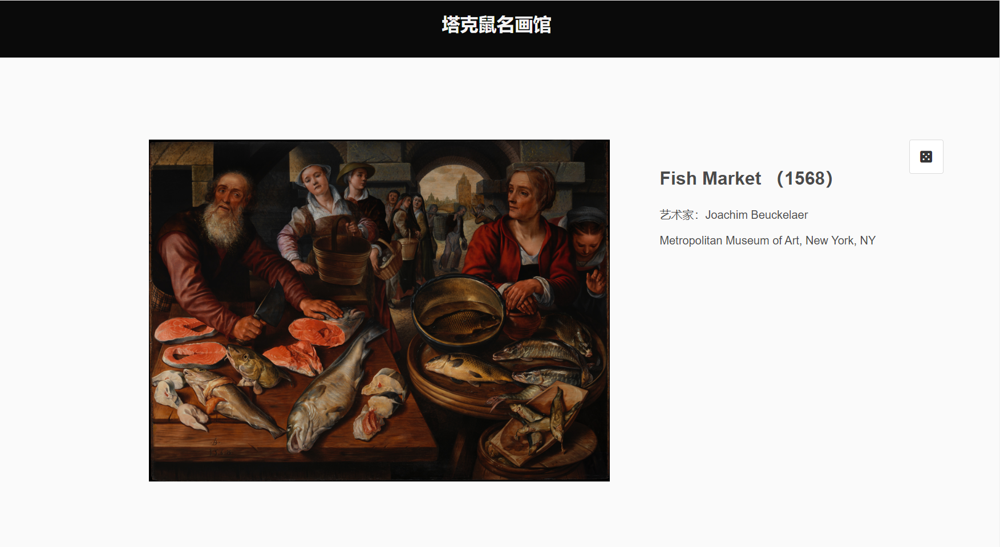

## Paintings Database
The Paintings Database is an extensive art database, primarily sourced from open museum data like the Metropolitan Museum of Art and Wikidata.
Unlike Google Art, this project aims to offer a comprehensive database of paintings for art enthusiasts to view and search.

## website
https://takeshuart.github.io/

